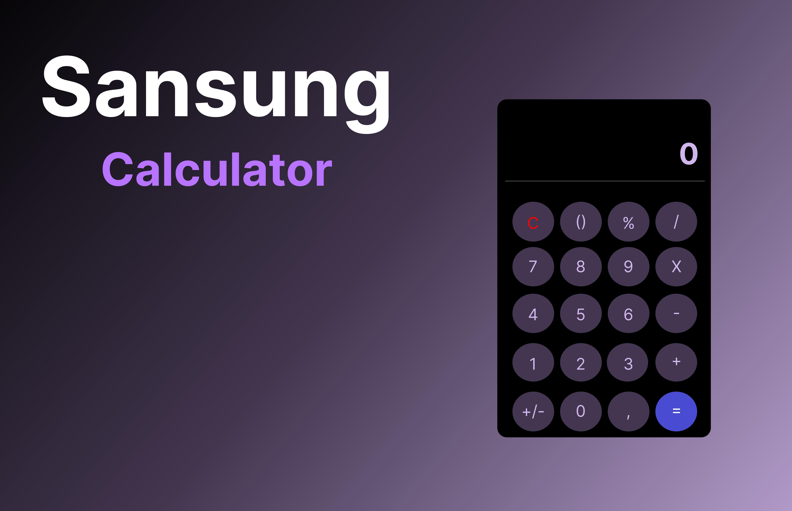

<h1 align="center"> Calculator </h1>

Calculadora feita em React com base na calculadora dos celulares da Sansung

  <a href="#-tecnologias">Tecnologias</a>&nbsp;&nbsp;&nbsp;|&nbsp;&nbsp;&nbsp;
  <a href="#-projeto">Projeto</a>&nbsp;&nbsp;&nbsp;|&nbsp;&nbsp;&nbsp;
  <a href="#-layout">Layout</a>&nbsp;&nbsp;&nbsp;|&nbsp;&nbsp;&nbsp;
  <a href="#memo-licença">Licença</a>

  

 

## 🚀 Tecnologias

Esse projeto foi desenvolvido com as seguintes tecnologias:

- CSS
- JavaScript
- Git e Github
- ReactJs

## 💻 Projeto

Uma calculadora criada com base na calculadora dos celulares da Sansung

